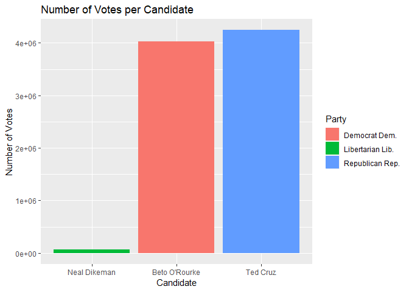

statistical testing
================
Courtney Chan
December 3, 2018

Trying linear regression with dataset merged\_nyt\_searches
===========================================================

First creating the dataset
--------------------------

scraping election results from the web
--------------------------------------

### New York Times voting results by county

This seems to have created two tables from the website data.

Tidying overall table for exploratory analysis
----------------------------------------------

Bar Plot of Votes per Candidate
-------------------------------



This plot illustrates how it was a close race between the top two candidates, O'Rourke and Cruz. As Dikeman had very few votes, we decided to omit Dikeman from further analyses.

Made the first table that which we have final results for the state of texas.

Tidying county table
--------------------

Made the second table which has all of the 254 county level data for Texas!

Plots for all counties
----------------------


comparing these county level election results to highly searched voter election interests in google
---------------------------------------------------------------------------------------------------

-using search terms "Midterms" and selecting dataset from top result

uploading county congressional district txt file
------------------------------------------------

plot for topics search per county
=================================

Still figuring out how to display this ideas: 1) interactive barchart in the current long format, if we use shiny we could show how the top topics vary among counties through use of drop-down menu to select county, etc. 2) figure out we can juxtapose how the counties voted vs. topics. Use of plotly for interactivity? 3) Alternative to first option, how can we show the distribution of topics among counties instead? 4)focus on 5 biggest counties or districts? but this would be biased as it may be a metropolitan area

``` r
merged_most_searched = merged_nyt_searches %>% 
  select(district_num, county, health_care, immigration, medicaid, medicare, september_11_attacks, cruz, o_rourke)
```

runnning linear regressions for all of the top five across counties topics, with outcome as number of votes for o rourke and cruz.

``` r
lm_o_hc = lm(o_rourke ~ health_care, data = merged_most_searched) %>% broom::tidy()

lm_cruz_hc = lm(cruz ~ health_care, data = merged_most_searched) %>% broom::tidy()

lm_o_hc
```

    ## # A tibble: 2 x 5
    ##   term        estimate std.error statistic p.value
    ##   <chr>          <dbl>     <dbl>     <dbl>   <dbl>
    ## 1 (Intercept)   55061.    22994.    2.39    0.0172
    ## 2 health_care     118.     1514.    0.0779  0.938

``` r
lm_cruz_hc
```

    ## # A tibble: 2 x 5
    ##   term        estimate std.error statistic p.value
    ##   <chr>          <dbl>     <dbl>     <dbl>   <dbl>
    ## 1 (Intercept)   42026.    15655.     2.68  0.00766
    ## 2 health_care     118.     1031.     0.115 0.909

``` r
lm_o_immigration = lm(o_rourke ~ immigration, data = merged_most_searched) %>% broom::tidy()

lm_cruz_immigration = lm(cruz ~ immigration, data = merged_most_searched) %>% broom::tidy()

lm_o_immigration
```

    ## # A tibble: 2 x 5
    ##   term        estimate std.error statistic     p.value
    ##   <chr>          <dbl>     <dbl>     <dbl>       <dbl>
    ## 1 (Intercept)  -63289.    24130.     -2.62 0.00916    
    ## 2 immigration   14426.     2732.      5.28 0.000000244

``` r
lm_cruz_immigration
```

    ## # A tibble: 2 x 5
    ##   term        estimate std.error statistic      p.value
    ##   <chr>          <dbl>     <dbl>     <dbl>        <dbl>
    ## 1 (Intercept)  -40846.    16376.     -2.49 0.0131      
    ## 2 immigration   10162.     1854.      5.48 0.0000000883

``` r
lm_o_caid = lm(o_rourke ~ medicaid, data = merged_most_searched) %>% broom::tidy()

lm_cruz_caid = lm(cruz ~ medicaid, data = merged_most_searched) %>% broom::tidy()

lm_o_caid
```

    ## # A tibble: 2 x 5
    ##   term        estimate std.error statistic p.value
    ##   <chr>          <dbl>     <dbl>     <dbl>   <dbl>
    ## 1 (Intercept) 56704.      29880.  1.90      0.0587
    ## 2 medicaid        3.48     4482.  0.000775  0.999

``` r
lm_cruz_caid
```

    ## # A tibble: 2 x 5
    ##   term        estimate std.error statistic p.value
    ##   <chr>          <dbl>     <dbl>     <dbl>   <dbl>
    ## 1 (Intercept)   41756.    20343.    2.05    0.0410
    ## 2 medicaid        304.     3052.    0.0995  0.921

``` r
lm_o_care = lm(o_rourke ~ medicare, data = merged_most_searched) %>% broom::tidy()

lm_cruz_care = lm(cruz ~ medicare, data = merged_most_searched) %>% broom::tidy()

lm_o_care
```

    ## # A tibble: 2 x 5
    ##   term        estimate std.error statistic  p.value
    ##   <chr>          <dbl>     <dbl>     <dbl>    <dbl>
    ## 1 (Intercept)   77788.    20854.      3.73 0.000228
    ## 2 medicare      -2612.     2364.     -1.10 0.270

``` r
lm_cruz_care
```

    ## # A tibble: 2 x 5
    ##   term        estimate std.error statistic   p.value
    ##   <chr>          <dbl>     <dbl>     <dbl>     <dbl>
    ## 1 (Intercept)   56946.    14202.      4.01 0.0000764
    ## 2 medicare      -1643.     1610.     -1.02 0.308

``` r
lm_o_911 = lm(o_rourke ~ september_11_attacks, data = merged_most_searched) %>% broom::tidy()

lm_cruz_911 = lm(cruz ~ september_11_attacks, data = merged_most_searched) %>% broom::tidy()

lm_o_911
```

    ## # A tibble: 2 x 5
    ##   term                 estimate std.error statistic p.value
    ##   <chr>                   <dbl>     <dbl>     <dbl>   <dbl>
    ## 1 (Intercept)            -9045.    29779.    -0.304  0.762 
    ## 2 september_11_attacks   13479.     5855.     2.30   0.0220

``` r
lm_cruz_911
```

    ## # A tibble: 2 x 5
    ##   term                 estimate std.error statistic p.value
    ##   <chr>                   <dbl>     <dbl>     <dbl>   <dbl>
    ## 1 (Intercept)            -6246.    20232.    -0.309  0.758 
    ## 2 september_11_attacks   10235.     3978.     2.57   0.0106
